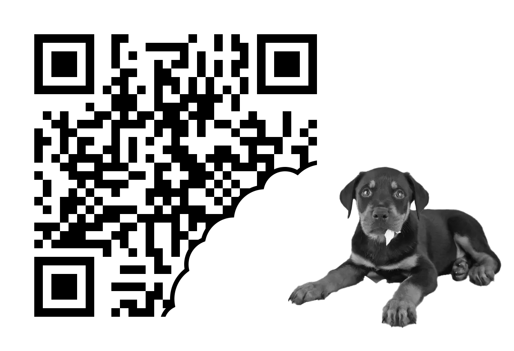
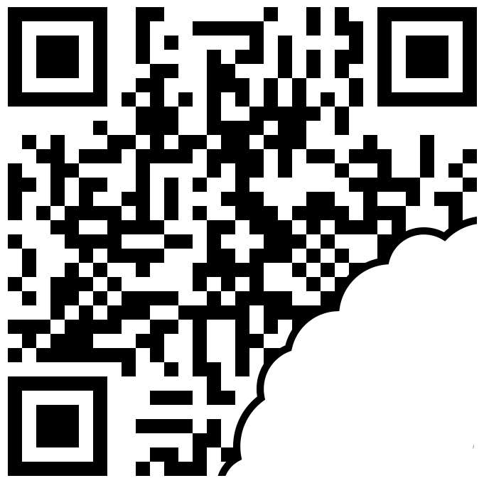
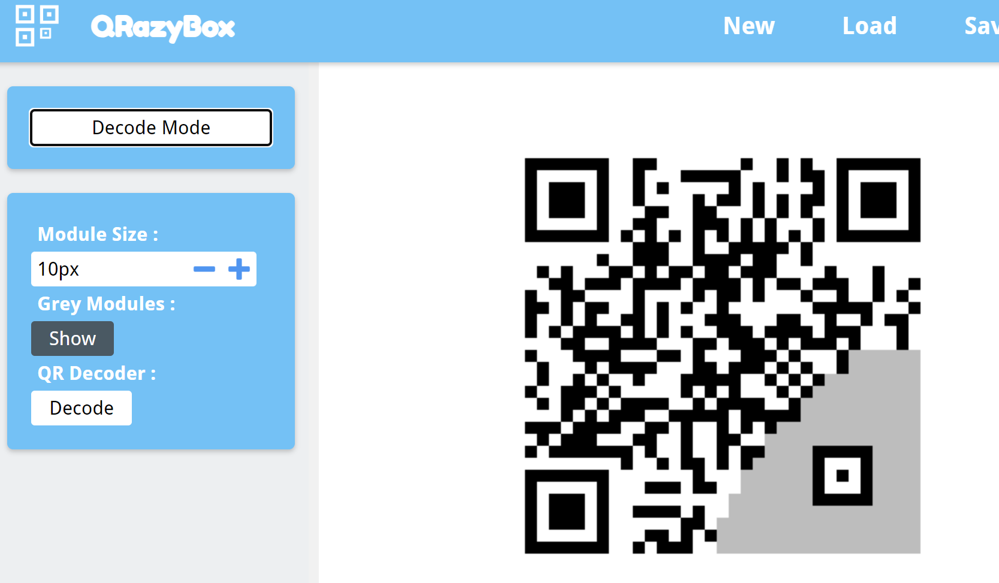
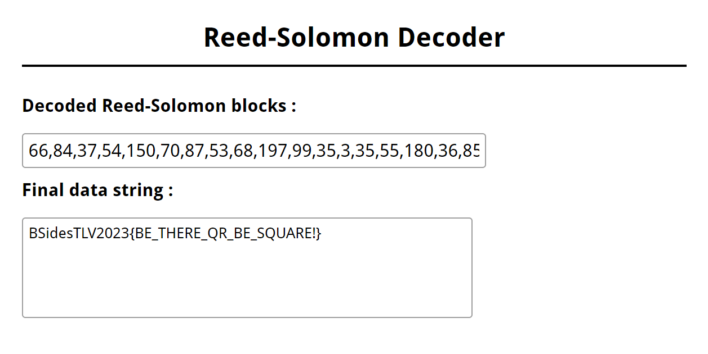

# The dog ate my QR!

**491 Points - 4 Solves**

Oh no! The dog ate my QR code! Can you help me decode it?

# Solution

I played this CTF with EPT, they're great (and very fast and smart solvers). Luckily for me I had solved a very similar chall for RTISEC CTF 2023 so i was able to first blood this chall🔥.

In the RITSEC chall I had already familiarized myself with [QRazybox](https://merri.cx/qrazybox/)(a great online tool for anything QR code related) and error correction level + mask patterns.

I started by (sadly) removing the dog from the image in hopes that QRazybox would be able to import the image for me (thus removing a lot of the manual work).

Unfortunatly, QRazybox didn't accept my image. So I spent some time reacreating the image in the QRazybox editor. 

During my recreation I quickly noticed that the "Format Info Pattern" parts of the QR code where completely empty. After I had finished recreating I tried using QRazybox's "Brute-force Format Info Pattern" to no avail. I knew that there was something fishy about the format info patterns so I just started trying different error correction levels and mask patterns and checking both the QR info and using the "Reed-Solomon Decoder". After a while I hit the flag at Error correction level **Q** and mask pattern **7**.

Reed-Solomon Decoder ftw!